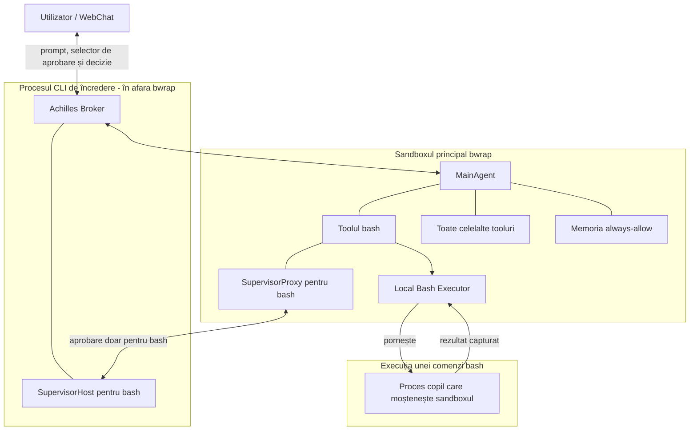

# Arhitectura propusă pentru izolarea AchillesCLI

> Status: implementată în launcherul CLI, brokerul de execuție, Supervisor și skillul Bash.

## Ideea pe scurt

Când pornim `achilles-cli` într-un folder, vrem ca acel folder să devină limita implicită de lucru pentru sesiunea respectivă.

Faptul că agentul este enabled global în Ploinky nu trebuie să îi dea acces global la filesystem. „Global” spune doar că agentul este disponibil în workspace. Accesul efectiv al unei sesiuni va fi stabilit de folderul din care este pornită comanda CLI.

Ca să izolăm agentul fără să mutăm deciziile de securitate în skilluri, nu punem tot procesul `achilles-cli` într-un singur `bwrap`. Păstrăm un proces mic de încredere în exterior, numit în documentul acesta **Achilles Broker**. În implementarea actuală, faptul că Brokerul este exterior nu îi permite unei comenzi `bash` să ruleze pe host: toate comenzile sunt pornite într-un sandbox nou, limitat la workspace.

Brokerul pornește `MainAgent` în `bwrap` și gestionează numai permisiunile. `MainAgent` gândește, ține conversația și pornește comenzile Bash în propriul sandbox. Brokerul nu gândește, nu execută comenzi și nu decide ce ar fi util; el aplică setarea `/permissions` prin Supervisor.

## Cum arată arhitectura

`SupervisorHost` este o responsabilitate a procesului exterior. `Local Bash Executor` este în procesul sandboxat și pornește comanda numai după ce fluxul agentic primește aprobarea necesară.

## Entitățile

### Comanda `cli achilles-cli`

Aceasta este intrarea în noua arhitectură.

Când este pornită, comanda află folderul curent, îi rezolvă calea reală și îl declară workspace-ul sesiunii. După aceea pornește Achilles Broker. Procesul acesta rămâne activ până când se închide sesiunea.

Nu contează dacă AchillesCLI este enabled global. Fiecare invocare primește propria limită, bazată pe folderul în care a fost pornită.

### Achilles Broker

Brokerul este granița dintre agent și sistemul real.

El are câteva responsabilități simple:

- pornește și oprește sandboxul în care rulează `MainAgent`;
- transmite prompturile și răspunsurile între CLI sau WebChat și `MainAgent`;
- păstrează setarea autoritativă selectată prin `/permissions`;
- primește numai cereri structurate de autorizare pentru `bash`;
- întoarce decizia `approve`, `deny` sau `alwaysApprove` către SupervisorProxy;
- oprește procesele copil când sesiunea este anulată sau închisă.

Brokerul nu trebuie să interpreteze promptul și nu trebuie să decidă singur dacă o comandă este bună pentru task. El aplică mecanic decizia Supervisorului.

După `allow` sau `always allow`, aprobarea rămâne un detaliu intern al Supervisorului. Executorul local capturează stdout și stderr și le întoarce direct skillului, în interiorul sandboxului. Handlerul `bash` întoarce apoi rezultatul în sesiunea agentică, fără să adauge text sau metadate prin care agentul să afle că utilizatorul a aprobat comanda. Utilizatorul vede numai răspunsul final compus de agent, nu outputul brut intermediar al toolului.

Brokerul rulează în afara `bwrap` ca să păstreze autoritatea asupra modului de permisiuni și ca procesul sandboxat să nu își poată aproba singur comenzile. Brokerul nu expune o operație `bash.execute` și nu pornește procese Bash.

### Sandboxul principal `bwrap`

`MainAgent` rulează în sandboxul principal pe toată durata sesiunii.

Comenzile Bash sunt procese copil ale acestui proces și moștenesc același mount namespace. Nu se construiește un al doilea `bwrap` pentru fiecare comandă.

În mod normal, vede:

- workspace-ul sesiunii;
- runtime-ul și dependențele necesare, în mod read-only;
- spații temporare izolate;
- numai resursele de sistem necesare funcționării CLI-ului.

Pe host, `bwrap` montează un `/proc` privat. Într-un container WebChat neprivilegiat, runtime-ul poate refuza această montare. Brokerul verifică suportul la pornire și folosește atunci un director `/proc` gol. Nu montează `/proc` din containerul exterior, pentru că prin el s-ar putea vedea rădăcinile altor procese și s-ar slăbi izolarea de filesystem.

Nu vede automat celelalte proiecte din workspace și nu primește întregul home al utilizatorului. O aprobare dată unei comenzi nu modifică sandboxul principal și nu lărgește permanent ce poate vedea `MainAgent`.

### MainAgent

`MainAgent` rămâne responsabil pentru conversație, planificare, alegerea skillurilor și compunerea răspunsului final.

El nu mai este procesul de încredere care poate lansa orice comandă direct pe sistem. Un tool poate lucra direct în workspace, fiind oricum limitat de `bwrap`. Pentru `bash`, Supervisorul cere autorizarea Brokerului, apoi executorul local pornește procesul copil în sandboxul deja existent.

Un skill care încearcă să ocolească Brokerul poate porni doar procese care moștenesc sandboxul principal. Cu alte cuvinte, poate lucra în workspace, dar nu poate transforma singur un proces într-unul nesandboxat.

### Setarea `/permissions`

AchillesCLI va avea comanda `/permissions`, cu două opțiuni:

1. **`ask-for-approval`** — fiecare comandă nouă cerută prin toolul `bash` trece prin Supervisor înainte de execuție. După `allow` sau `always allow`, executorul local pornește comanda ca proces copil al `MainAgent`.
2. **`full-access`** — comenzile toolului `bash` sar peste întrebarea Supervisorului și sunt pornite direct de executorul local. Ele moștenesc același sandbox al `MainAgent`; un eșec produs de accesul la o cale exterioară este întors ca rezultat obișnuit al toolului.

`ask-for-approval` este modul implicit și sigur atunci când workspace-ul nu are încă o valoare validă. Modul ales prin `/permissions` este salvat per workspace în `.achilles-cli/settings.json`, în același fișier cu modelul selectat, și este restaurat la următoarea pornire din acel folder. Brokerul rămâne autoritatea reală la execuție: schimbarea este persistată numai după ce Brokerul o acceptă prin canalul trusted. Procesul din sandbox nu poate trece singur sesiunea în `full-access`.

Flagul `--permissions` are prioritate față de valoarea salvată pentru pornirea respectivă, fără să o rescrie. Aprobările punctuale memorate prin `always allow` rămân doar în memoria sesiunii și nu sunt puse în `settings.json`.

La bootstrap, CLI-ul primește temporar o capabilitate privată de control. O citește și șterge imediat fișierul prin care a fost transmisă. Numai clientul care deține capabilitatea poate schimba `/permissions` sau poate transforma răspunsul utilizatorului într-o decizie de aprobare. Un skill poate vedea socketul normal al Brokerului ca să ceară execuția, dar nu își poate trimite singur `allow`.

Celelalte tooluri nu trec prin acest mecanism de aprobare. Ele sunt executate normal în `MainAgent` și rămân limitate de sandboxul principal. `/permissions` controlează numai comenzile locale lansate prin `bash`.

### SupervisorProxy

`MainAgent` are în continuare un Supervisor, dar obiectul din interior este doar un proxy folosit de toolul `bash`.

În modul `ask-for-approval`, Proxy-ul pregătește înainte de execuție cererea exactă formată din numele toolului și parametrii lui. În modul `full-access`, comenzile `bash` nu produc cereri de aprobare și sunt trimise direct Brokerului pentru execuție sandboxată.

Apelurile celorlalte tooluri nu ajung la `SupervisorProxy` și nu produc întrebări de aprobare.

Proxy-ul nu poate fabrica singur o aprobare validă. Dacă procesul exterior nu răspunde sau respinge cererea, operația este refuzată.

### SupervisorHost

`SupervisorHost` este autoritatea reală de aprobare pentru `bash` și rulează lângă Broker, în afara `bwrap`. În `ask-for-approval` este consultat înainte de fiecare comandă nouă. În `full-access` nu este consultat pentru execuțiile Bash obișnuite.

Când Supervisorul este apelat înaintea unei comenzi în `ask-for-approval`, utilizatorul primește trei opțiuni:

- **`allow`** — comanda se execută o singură dată în sandboxul workspace-ului și nu este adăugată în memoria `always-allow`;
- **`deny`** — Supervisorul încheie etapa de aprobare fără să apeleze handlerul skillului `bash`; AgentLib memorează cu un `resultRef` numele exact al toolului, parametrii exacți și motivul refuzului, apoi plannerul continuă în același prompt;
- **`always allow`** — comanda se execută în sandboxul workspace-ului, iar aprobarea exactă este memorată în `MainAgent` pentru restul sesiunii.

Supervisorul decide pentru combinația exactă `toolName + params`. O aprobare pentru o anumită comandă nu înseamnă că toate comenzile viitoare sunt aprobate.

### Memoria `always-allow`

Memoria `always-allow` rămâne în `MainAgent`, în interiorul sandboxului. Cheia unei aprobări conține numai:

- numele toolului;
- parametrii exacți ai apelului.

Workspace-ul nu trebuie repetat în cheie, deoarece este fix pentru întreaga sesiune CLI. Dacă `bash` va primi vreodată un `cwd` configurabil, acel `cwd` va face parte din parametrii toolului și va intra automat în aceeași cheie.

Dacă numele toolului sau parametrii se schimbă, este o comandă nouă și se cere altă aprobare.

`allow` produce o aprobare pentru o singură execuție sandboxată și nu intră în memorie. `always allow` poate fi refolosit numai pentru aceeași combinație `toolName + params`; apelurile viitoare identice sar peste întrebarea Supervisorului, dar rămân în sandbox. Aprobarea expiră când se termină procesul CLI.

Memoria din `MainAgent` evită întrebările repetate. Brokerul nu primește și nu validează această memorie, deoarece nu execută comanda. Limita de securitate rămâne sandboxul moștenit de executorul local.

### Local Bash Executor

Local Bash Executor rulează lângă skillul `bash`, în procesul `MainAgent` deja izolat. El pornește efectiv comenzile aprobate și le capturează rezultatul.

El are o singură limită de execuție și două moduri de autorizare:

1. **`ask-for-approval`** — Supervisorul cere aprobarea înainte de fiecare combinație nouă `toolName + params`, apoi executorul pornește exact comanda aprobată.
2. **`full-access`** — executorul pornește automat comanda, fără o etapă de aprobare.

O intrare existentă în memoria `always-allow` permite aceleiași combinații `toolName + params` să sară peste întrebare, nu peste sandbox.

Fiecare comandă primește propriul proces copil, dar nu propriul sandbox. Procesul moștenește mounturile sandboxului `MainAgent`; nu încercăm să le modificăm și nu construim mounturi punctuale pentru căi deduse din comandă.

`bwrap` nu oferă un eveniment sigur de tip „comanda a încercat să iasă din workspace”. Procesul copil poate primi o eroare obișnuită precum `permission denied`, `read-only file system` sau `no such file or directory`. Unele căi-părinte sintetice pot chiar exista în namespace, dar conțin numai mounturile pe care Brokerul le-a expus. De aceea, implementarea actuală nu încearcă să clasifice semantic comenzile și nu transformă niciun rezultat într-o escaladare.

## Ce se întâmplă când comanda are nevoie de alt folder

Să presupunem că sesiunea a fost pornită în workspace-ul `proiect-a`, iar o comandă cere acces la `proiect-b`.

`MainAgent` și procesele Bash nu primesc acces la `proiect-b`. În `full-access`, comanda rulează automat în namespace-ul limitat la `proiect-a`; în `ask-for-approval`, aprobarea permite doar pornirea aceleiași comenzi în același namespace. Dacă acea comandă încearcă să citească sau să scrie în `proiect-b`, vede o cale absentă, read-only sau altă reprezentare izolată și primește rezultatul obișnuit al procesului. Nu există retry în exterior.

Nu încercăm să detectăm complet intenția comenzii din parametri. Un script, un symlink, o variabilă sau un proces copil poate accesa căi care nu apar direct în text. Limita de securitate este namespace-ul `bwrap`, nu clasificarea comenzii.

## Ce se întâmplă cu toolurile care nu pornesc comenzi

Toolurile care lucrează numai cu date în memorie nu au nevoie de Local Bash Executor și nu trec prin Supervisor.

Toolurile care citesc sau scriu fișiere direct pot lucra în workspace deoarece rulează în sandboxul principal. Ele sunt lăsate în pace de sistemul `/permissions`; izolarea este aplicată de `bwrap`, nu prin întrebări de aprobare pentru fiecare tool.

Dacă un astfel de tool are nevoie de o cale din afara workspace-ului, nu primește lărgirea sandboxului principal. Accesul exterior nu este disponibil în implementarea actuală și va necesita în viitor o capabilitate separată, explicită.

Apelurile către alți agenți prin MCP rămân sub politica MCP și prin routerul Ploinky. Sandboxul local nu înlocuiește autentificarea și politica agent-to-agent.

## Conversation Sessions

AchillesCLI owns conversation sessions independently of WebChat. Each workspace stores validated session JSON under `.achilles-cli/sessions/`, while `.achilles-cli/settings.json` keeps `currentSessionId` beside the selected model and permission mode. Natural-language user/assistant turns enter this store as model context. Slash commands visibly submitted through WebChat, their visible responses, and any task references they create are retained in the same ordered session for presentation, but command records carry `context: false`; silent WebChat UI commands remain control traffic only.

At startup, AchillesCLI loads or creates the current session in single-shot, terminal REPL, and WebChat modes. Its ordered contextual user/assistant records are supplied once as `initialHistory` on the first natural-language prompt that creates the new MainAgent session; task items and `context: false` presentation records are filtered out. Slash commands do not consume the pending history. `/session` opens or refreshes the session selector, `/session new` creates a fresh session, and `/session resume <session-id>` selects an existing one. The WebChat command catalog attaches saved-session completions to `resume`, displaying the first user-message preview while inserting the corresponding session id.

In WebChat mode, AchillesCLI publishes `__webchatSession` control envelopes for current, list, and selected state. Ploinky forwards those snapshots to the browser and sends the same slash commands for UI actions, but it neither persists conversation files nor injects history into incoming messages.

## Background Tasks

AchillesCLI owns delegated-task state in every launch mode. Metadata is an append-only journal at `.achilles-cli/tasks/agent_tasks`, while task logs and ingestion cursors live under `.achilles-cli/tasks/task_logs/`. Each new process reattaches records whose local status is `ongoing` and continues router-mediated status polling. The local status vocabulary remains `ongoing`, `finished`, `stopped`, and `error`; provider states such as `queued`, `running`, `cancelling`, and `completed` remain in `remoteStatus`.

`/tasks [count|all]` lists the stored journal, `/task view <task-id>` reads a complete log, `/task stop <task-id>` cancels the stored remote task, and `/task continue <task-id> <prompt>` invokes the stored continuation tool and opaque handle. A continuation creates a new remote task but retains the local task id and increments its turn. AchillesCLI appends the submitted continuation prompt to the durable log with a `you> ` prefix before provider output and publishes that delta with the new offset. Terminal and WebChat autocomplete both display task names while inserting compatible ids for the selected action.

WebChat is a presentation adapter for this contract. Its Tasks button sends `/tasks`; view, stop, and continuation actions send the corresponding `/task` commands as invisible controls. AchillesCLI emits generic `__webchatTask` envelopes while suppressing textual acknowledgements and errors for those invisible commands, and Ploinky validates and forwards the envelopes over the existing EventSource stream without writing task metadata or logs. Ploinky retains only the authenticated HTML task-view endpoint. Remote cancellation remains router-mediated: AchillesCLI signs a request-bound Agent Assertion, and the router mints the target AgentServer request without forwarding browser credentials.

## Ce rămâne neschimbat

- `MainAgent` continuă să planifice și să execute skilluri.
- Celelalte tooluri continuă să se execute fără aprobări suplimentare.
- Supervisorul primește numai comenzile toolului `bash` și parametrii lor.
- Memoria `always-allow` rămâne în sesiunea `MainAgent`.
- Folderul selectat în WebChat rămâne folderul de lucru al sesiunii.
- Ploinky rămâne responsabil pentru pornirea agentului, rutare și WebChat.
- Politica MCP rămâne separată de aprobările comenzilor locale.

## Ce se schimbă conceptual

- Procesul pornit de comanda CLI devine Broker și rămâne în afara `bwrap`.
- `MainAgent` este mutat într-un proces copil izolat.
- `/permissions` oferă modurile `ask-for-approval` și `full-access`, iar `full-access` rămâne limitat automat la workspace.
- Supervisorul folosit de `bash` devine un proxy către autoritatea exterioară.
- Execuția comenzilor este delegată de skillul `bash` către Local Bash Executor din sandboxul `MainAgent`.
- În `ask-for-approval`, utilizatorul poate răspunde cu `allow`, `deny` sau `always allow`.
- Numai `always allow` intră în memoria internă a `MainAgent`.
- Aprobările memorate sunt legate numai de `toolName + params`, nu doar de numele toolului.
- În ambele moduri, fiecare comandă moștenește singurul `bwrap` al `MainAgent`.
- Rezultatele care seamănă cu un blocaj de sandbox rămân rezultate obișnuite și nu declanșează acces pe host.

## Reguli de securitate ale arhitecturii

1. În `ask-for-approval`, dacă Brokerul sau Supervisorul nu sunt disponibili, comanda `bash` se refuză.
2. Toolurile diferite de `bash` nu produc cereri de aprobare.
3. Procesul din sandbox nu poate declara singur că o comandă este aprobată sau că sesiunea este în `full-access`; ambele operații cer capabilitatea privată de control păstrată numai de bucla CLI.
4. Brokerul aplică modul `/permissions` numai când SupervisorProxy îi cere autorizarea. `always allow` este memorat de `MainAgent` pentru cheia exactă `toolName + params`, nu de Broker.
5. Workspace-ul este implicit în sesiunea CLI și rămâne fix cât timp memoria `always-allow` este activă.
6. Parametrii comenzii nu sunt tratați ca o descriere sigură și completă a fișierelor pe care procesul le va accesa.
7. Un exit code nenul nu este automat considerat blocaj de sandbox.
8. Niciun rezultat al procesului nu poate produce automat o execuție în afara sandboxului.
9. `deny` oprește apelul înainte de handlerul `bash` și devine rezultat de tool în contextul agentului; plannerul poate explica refuzul sau poate alege o alternativă sigură, dar nu cere din nou aceeași comandă în același turn.
10. Procesele rulează cu utilizatorul curent; sandboxingul nu oferă privilegii de root.
11. Închiderea sesiunii invalidează memoria `always-allow` și oprește procesele copil.
12. Outputul brut al comenzilor nu este scris pe stdout/stderr-ul AchillesCLI. Este capturat de executor, returnat skillului prin Broker și introdus numai în contextul sesiunii agentice.
13. Brokerul rămâne cât mai mic, nu încarcă skilluri sau logică de planificare și nu expune o rută de execuție Bash.

## Limita acestei propuneri

Propunerea descrie izolarea filesystemului și execuția controlată a proceselor locale. Politica exactă de rețea poate fi stabilită separat, deoarece AchillesCLI trebuie să poată comunica cu serviciile LLM și cu agenții autorizați.

În terminal, Supervisorul poate opri execuția și poate citi direct `allow`, `deny` sau `always allow`.

În WebChat, Brokerul emite o cerere structurată de interacțiune și păstrează apelul original suspendat. Ploinky nu afișează cererea ca mesaj de chat: deschide deasupra composerului un selector dedicat cu `Always approve`, `Allow` și `Deny`, în această ordine, iar prima opțiune este selectată implicit. Utilizatorul poate schimba opțiunea cu săgețile și o confirmă cu Enter sau prin click.

Decizia ajunge la CLI pe o rută de control autentificată și este corelată cu identificatorul cererii. CLI-ul o separă de prompturile conversației și o transmite Brokerului prin capabilitatea privată de control. Astfel, răspunsul nu intră în istoricul chatului și nu pornește un turn nou. Brokerul rezolvă o singură dată cererea suspendată, iar execuția agentului continuă în același prompt cu rezultatul comenzii sau cu refuzul.

Ploinky păstrează cererea activă numai în memoria runtime-ului. La o reconectare EventSource, selectorul este retrimis browserului; la închiderea procesului, expirare sau schimbarea modului de permisiuni, cererea este închisă și nu poate fi reutilizată.

## Condiții pentru implementare

1. Runtime-ul Achilles trebuie să aibă executabilul `bwrap` disponibil.
2. Brokerul trebuie să pornească `MainAgent` în sandbox, iar executorul Bash trebuie să rămână în acel proces și să îi moștenească namespace-ul.
3. Protocolul intern trebuie să transporte numai cererile de aprobare și deciziile utilizatorului; stdout/stderr sunt capturate local și returnate exclusiv skillului.
4. Starea autoritativă a unei aprobări WebChat pending aparține sesiunii CLI, iar WebChat păstrează numai copia volatilă necesară selectorului și reconectării.
5. O extensie viitoare poate adăuga în cererea sesiunii agentice un parametru explicit de escaladare. Supervisorul și Brokerul îl vor interpreta înainte de execuție și vor cere aprobarea utilizatorului. Parametrul nu este implementat acum și nu poate fi dedus dintr-un simplu eșec al comenzii.
6. Fiecare decizie WebChat trebuie validată față de sesiune, tab, cerere și una dintre opțiunile declarate de agent; prima decizie validă închide cererea.

## Rezultatul dorit

AchillesCLI poate rămâne enabled global, dar fiecare sesiune este izolată în folderul din care a fost pornită.

`MainAgent` poate lucra liber în acel workspace. În `ask-for-approval`, toate comenzile toolului `bash` ajung la Supervisor înainte de execuție. În `full-access`, ele rulează automat. În ambele moduri, comenzile Bash rămân în workspace și nu există execuție în afara sandboxului.
