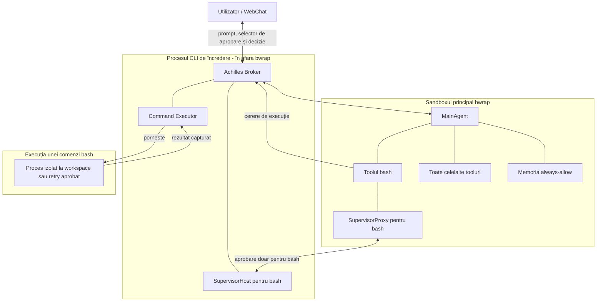

# Arhitectura propusă pentru izolarea AchillesCLI

> Status: implementată în launcherul CLI, brokerul de execuție, Supervisor și skillul Bash.

## Ideea pe scurt

Când pornim `achilles-cli` într-un folder, vrem ca acel folder să devină limita implicită de lucru pentru sesiunea respectivă.

Faptul că agentul este enabled global în Ploinky nu trebuie să îi dea acces global la filesystem. „Global” spune doar că agentul este disponibil în workspace. Accesul efectiv al unei sesiuni va fi stabilit de folderul din care este pornită comanda CLI.

Ca să putem izola agentul și, în același timp, să permitem o comandă în afara folderului după aprobare, nu putem pune tot procesul `achilles-cli` într-un singur `bwrap`. Avem nevoie de un proces mic rămas în exterior, numit în documentul acesta **Achilles Broker**.

Brokerul pornește `MainAgent` în `bwrap`, primește cererile lui de execuție și pornește fiecare comandă în mediul potrivit. `MainAgent` gândește și ține conversația. Brokerul nu gândește și nu decide ce ar fi util; el aplică setarea `/permissions` și deciziile Supervisorului pentru comenzile toolului `bash`.

## Cum arată arhitectura

`SupervisorHost` și `Command Executor` sunt responsabilități ale procesului exterior. Ele pot face parte din același proces cu Brokerul; în diagramă sunt separate doar ca să fie clar cine decide și cine execută.

## Entitățile

### Comanda `cli achilles-cli`

Aceasta este intrarea în noua arhitectură.

Când este pornită, comanda află folderul curent, îi rezolvă calea reală și îl declară workspace-ul sesiunii. După aceea pornește Achilles Broker. Procesul acesta rămâne activ până când se închide sesiunea.

Nu contează dacă AchillesCLI este enabled global. Fiecare invocare primește propria limită, bazată pe folderul în care a fost pornită.

### Achilles Broker

Brokerul este granița dintre agent și sistemul real.

El are câteva responsabilități simple:

- pornește și oprește sandboxul în care rulează `MainAgent`;
- transmite prompturile și răspunsurile între CLI sau WebChat și `MainAgent`;
- păstrează setarea autoritativă selectată prin `/permissions`;
- primește cereri structurate de aprobare și execuție pentru `bash`;
- verifică dovada aprobării înainte de execuția unei comenzi `bash`;
- pornește comenzile `bash` aprobate în procese separate;
- capturează stdout și stderr fără să le scrie direct în WebChat sau terminal;
- oprește procesele copil când sesiunea este anulată sau închisă.

Brokerul nu trebuie să interpreteze promptul și nu trebuie să decidă singur dacă o comandă este bună pentru task. El aplică mecanic decizia Supervisorului.

După `allow` sau `always allow`, aprobarea rămâne un detaliu intern al Supervisorului și Brokerului. Executorul capturează stdout și stderr și le întoarce numai către skill prin socketul Brokerului. Handlerul `bash` întoarce apoi rezultatul în sesiunea agentică, fără să adauge text sau metadate prin care agentul să afle că utilizatorul a aprobat comanda. Utilizatorul vede numai răspunsul final compus de agent, nu outputul brut intermediar al toolului.

Pentru că Brokerul rulează în afara `bwrap`, el poate porni mai întâi o comandă într-un sandbox limitat la workspace și, după aprobare, poate relansa exact aceeași comandă în exterior. Asta nu modifică sandboxul principal și nu îi dă automat aceeași libertate lui `MainAgent`.

### Sandboxul principal `bwrap`

`MainAgent` rulează în sandboxul principal pe toată durata sesiunii.

În mod normal, vede:

- workspace-ul sesiunii;
- runtime-ul și dependențele necesare, în mod read-only;
- spații temporare izolate;
- numai resursele de sistem necesare funcționării CLI-ului.

Pe host, `bwrap` montează un `/proc` privat. Într-un container WebChat neprivilegiat, runtime-ul poate refuza această montare. Brokerul verifică suportul la pornire și folosește atunci un director `/proc` gol. Nu montează `/proc` din containerul exterior, pentru că prin el s-ar putea vedea rădăcinile altor procese și s-ar slăbi izolarea de filesystem.

Nu vede automat celelalte proiecte din workspace și nu primește întregul home al utilizatorului. O aprobare dată unei comenzi nu modifică sandboxul principal și nu lărgește permanent ce poate vedea `MainAgent`.

### MainAgent

`MainAgent` rămâne responsabil pentru conversație, planificare, alegerea skillurilor și compunerea răspunsului final.

El nu mai este procesul de încredere care poate lansa orice comandă direct pe sistem. Un tool poate lucra direct în workspace, fiind oricum limitat de `bwrap`. Dacă are nevoie de o execuție controlată sau de acces în afara limitei, trimite o cerere Brokerului.

Un skill care încearcă să ocolească Brokerul poate porni doar procese care moștenesc sandboxul principal. Cu alte cuvinte, poate lucra în workspace, dar nu poate transforma singur un proces într-unul nesandboxat.

### Setarea `/permissions`

AchillesCLI va avea comanda `/permissions`, cu două opțiuni:

1. **`ask-for-approval`** — fiecare comandă cerută prin toolul `bash` trece prin Supervisor înainte de execuție. După `allow` sau `always allow`, Brokerul pornește comanda exactă în afara sandboxului de workspace.
2. **`full-access`** — comenzile toolului `bash` rulează automat cât timp rămân în workspace-ul sesiunii. Brokerul le pornește mai întâi într-un `bwrap` limitat la acel workspace. Dacă o comandă pare blocată pentru că încearcă să iasă, Brokerul apelează Supervisorul și cere aprobarea pentru relansarea exactă în afara sandboxului.

`ask-for-approval` este modul implicit și sigur. Setarea este valabilă pentru sesiunea CLI curentă și este cunoscută atât de `MainAgent`, pentru comportamentul conversației, cât și de Broker, care este autoritatea reală la execuție. Procesul din sandbox nu poate trece singur sesiunea în `full-access`.

La bootstrap, CLI-ul primește temporar o capabilitate privată de control. O citește și șterge imediat fișierul prin care a fost transmisă. Numai clientul care deține capabilitatea poate schimba `/permissions` sau poate transforma răspunsul utilizatorului într-o decizie de aprobare. Un skill poate vedea socketul normal al Brokerului ca să ceară execuția, dar nu își poate trimite singur `allow`.

Celelalte tooluri nu trec prin acest mecanism de aprobare. Ele sunt executate normal în `MainAgent` și rămân limitate de sandboxul principal. `/permissions` controlează numai comenzile locale lansate prin `bash`.

### SupervisorProxy

`MainAgent` are în continuare un Supervisor, dar obiectul din interior este doar un proxy folosit de toolul `bash`.

În modul `ask-for-approval`, Proxy-ul pregătește înainte de execuție cererea exactă formată din numele toolului și parametrii lui. În modul `full-access`, aceeași cerere este trimisă numai când Brokerul sau agentul solicită escaladarea unei comenzi care nu poate termina în sandboxul workspace-ului.

Apelurile celorlalte tooluri nu ajung la `SupervisorProxy` și nu produc întrebări de aprobare.

Proxy-ul nu poate fabrica singur o aprobare validă. Dacă procesul exterior nu răspunde sau respinge cererea, operația este refuzată.

### SupervisorHost

`SupervisorHost` este autoritatea reală de aprobare pentru `bash` și rulează lângă Broker, în afara `bwrap`. În `ask-for-approval` este consultat înainte de fiecare comandă nouă. În `full-access` este consultat numai pentru escaladarea unei comenzi în afara workspace-ului.

Când Supervisorul este apelat — înaintea unei comenzi în `ask-for-approval` sau pentru escaladare în `full-access` — utilizatorul primește trei opțiuni:

- **`allow`** — comanda se execută o singură dată în afara sandboxului de workspace și nu este adăugată în memoria `always-allow`;
- **`deny`** — Supervisorul încheie etapa de aprobare fără să apeleze handlerul skillului `bash`; AgentLib memorează cu un `resultRef` numele exact al toolului, parametrii exacți și motivul refuzului, apoi plannerul continuă în același prompt;
- **`always allow`** — comanda se execută în afara sandboxului de workspace, iar aprobarea exactă este memorată în `MainAgent` pentru restul sesiunii.

Supervisorul decide pentru combinația exactă `toolName + params`. O aprobare pentru o anumită comandă nu înseamnă că toate comenzile viitoare sunt aprobate.

Decizia lui produce o dovadă de aprobare legată de aceeași combinație `toolName + params`. Brokerul poate verifica dovada înainte să execute ceva.

### Memoria `always-allow`

Memoria `always-allow` rămâne în `MainAgent`, în interiorul sandboxului. Cheia unei aprobări conține numai:

- numele toolului;
- parametrii exacți ai apelului.

Workspace-ul nu trebuie repetat în cheie, deoarece este fix pentru întreaga sesiune CLI. Dacă `bash` va primi vreodată un `cwd` configurabil, acel `cwd` va face parte din parametrii toolului și va intra automat în aceeași cheie.

Dacă numele toolului sau parametrii se schimbă, este o comandă nouă și se cere altă aprobare.

`MainAgent` nu memorează doar răspunsul „da”. El memorează dovada primită de la `SupervisorHost`. La reutilizare, trimite dovada Brokerului împreună cu cererea exactă. Brokerul verifică dacă ele corespund.

`allow` produce o aprobare pentru o singură execuție în afara sandboxului și nu intră în memorie. `always allow` poate fi refolosit numai pentru aceeași combinație `toolName + params`; apelurile viitoare identice pot fi pornite direct în exterior și aprobarea expiră când se termină procesul CLI.

Memoria din `MainAgent` evită întrebările repetate. Ea nu devine însă autoritatea de securitate: Brokerul continuă să verifice dovada la fiecare execuție.

### Command Executor

Command Executor este partea Brokerului care pornește efectiv comenzile primite de la toolul `bash`.

El are două moduri conceptuale de execuție:

1. **`ask-for-approval`** — cere aprobarea înainte de fiecare combinație nouă `toolName + params`. După `allow` sau `always allow`, execută exact comanda aprobată în afara sandboxului de workspace.
2. **`full-access`** — execută mai întâi comanda într-un `bwrap` nou, cu acces complet în workspace-ul sesiunii și fără acces la restul filesystemului. Dacă execuția este blocată probabil de sandbox, cere aprobarea și, după `allow` sau `always allow`, relansează exact comanda în afara lui `bwrap`.

O intrare existentă în memoria `always-allow` permite aceleiași combinații `toolName + params` să sară peste întrebarea și încercarea sandboxată și să fie executată direct în exterior.

Fiecare comandă primește propriul proces. Nu încercăm să modificăm mounturile sandboxului în care rulează deja `MainAgent` și nu construim mounturi punctuale pentru căi deduse din comandă.

`bwrap` nu oferă un eveniment sigur de tip „comanda a încercat să iasă din workspace”. Procesul copil primește de obicei o eroare obișnuită precum `permission denied`, `operation not permitted`, `read-only file system` sau `no such file or directory`, iar `bwrap` propagă rezultatul lui.

Brokerul poate identifica automat numai blocajele probabile, folosind codul de ieșire și mesajele din stdout/stderr. Nu întreabă utilizatorul după orice eșec, deoarece o comandă poate eșua normal din multe alte motive.

Pentru cazurile ambigue, rezultatul sandboxat ajunge în contextul agentului. Agentul poate solicita explicit escaladarea aceleiași combinații `toolName + params`; Supervisorul cere atunci aprobarea, iar Brokerul relansează exact comanda în exterior. Cererea de escaladare este metadată de control și nu schimbă cheia memorată.

## Ce se întâmplă când comanda are nevoie de alt folder

Să presupunem că sesiunea a fost pornită în workspace-ul `proiect-a`, iar o comandă cere acces la `proiect-b`.

`MainAgent` nu primește direct acces la `proiect-b`. Toolul `bash` trimite către Supervisor numele toolului și parametrii exacți ai comenzii.

În `full-access`, prima execuție vede doar `proiect-a`, deci accesul la `proiect-b` eșuează. Dacă Brokerul recunoaște un blocaj probabil de sandbox sau agentul cere explicit escaladarea după eșec, Supervisorul întreabă utilizatorul. După aprobare, Brokerul relansează numai comanda respectivă în exterior. Comanda poate atunci accesa `proiect-b`, dar sandboxul principal al lui `MainAgent` rămâne neschimbat.

O altă comandă sau alți parametri reprezintă altă operație și nu folosesc automat aprobarea anterioară.

Supervisorul poate vedea tentativele evidente de acces exterior din parametri, dar aceasta nu este o analiză completă a efectelor comenzii. Un script, un symlink sau un proces copil poate accesa alte căi fără ca ele să apară direct în textul comenzii. De aceea, utilizatorul aprobă comanda exactă și toate efectele ei, nu o listă de căi dedusă automat.

## Ce se întâmplă cu toolurile care nu pornesc comenzi

Toolurile care lucrează numai cu date în memorie nu au nevoie de Command Executor și nu trec prin Supervisor.

Toolurile care citesc sau scriu fișiere direct pot lucra în workspace deoarece rulează în sandboxul principal. Ele sunt lăsate în pace de sistemul `/permissions`; izolarea este aplicată de `bwrap`, nu prin întrebări de aprobare pentru fiecare tool.

Dacă un astfel de tool are nevoie de o cale din afara workspace-ului, nu primește lărgirea întregului sandbox principal. Accesul exterior trebuie exprimat printr-o comandă `bash` mediată de Broker sau printr-o capabilitate separată proiectată în viitor.

Apelurile către alți agenți prin MCP rămân sub politica MCP și prin routerul Ploinky. Sandboxul local nu înlocuiește autentificarea și politica agent-to-agent.

## Ce rămâne neschimbat

- `MainAgent` continuă să planifice și să execute skilluri.
- Celelalte tooluri continuă să se execute fără aprobări suplimentare.
- Supervisorul primește numai comenzile toolului `bash` și parametrii lor.
- Memoria `always-allow` rămâne în sesiunea `MainAgent`.
- Folderul selectat în WebChat rămâne folderul de lucru al sesiunii.
- Ploinky rămâne responsabil pentru pornirea agentului, rutare și WebChat.
- Politica MCP rămâne separată de aprobările comenzilor locale.

## Ce se schimbă conceptual

- Procesul pornit de comanda CLI devine Broker și rămâne în afara `bwrap`.
- `MainAgent` este mutat într-un proces copil izolat.
- `/permissions` oferă modurile `ask-for-approval` și `full-access`, iar `full-access` rămâne limitat automat la workspace.
- Supervisorul folosit de `bash` devine un proxy către autoritatea exterioară.
- Execuția comenzilor este mutată din skillul `bash` în Command Executor.
- În `ask-for-approval`, utilizatorul poate răspunde cu `allow`, `deny` sau `always allow`.
- Numai `always allow` intră în memoria internă a `MainAgent`.
- Aprobările memorate sunt legate numai de `toolName + params`, nu doar de numele toolului.
- În `full-access`, o comandă este încercată mai întâi într-un `bwrap` limitat la workspace.
- Blocajele probabile de sandbox și cererile explicite de escaladare ajung la Supervisor.
- O comandă aprobată pentru escaladare rulează separat și nu modifică sandboxul întregii sesiuni.

## Reguli de securitate ale arhitecturii

1. În `ask-for-approval`, dacă Brokerul sau Supervisorul nu sunt disponibili, comanda `bash` se refuză.
2. Toolurile diferite de `bash` nu produc cereri de aprobare.
3. Procesul din sandbox nu poate declara singur că o comandă este aprobată sau că sesiunea este în `full-access`; ambele operații cer capabilitatea privată de control păstrată numai de bucla CLI.
4. Brokerul verifică modul `/permissions`, dovada și combinația exactă `toolName + params` înainte de fiecare execuție în afara sandboxului.
5. Workspace-ul este implicit în sesiunea CLI și rămâne fix cât timp memoria `always-allow` este activă.
6. Parametrii comenzii nu sunt tratați ca o descriere sigură și completă a fișierelor pe care procesul le va accesa.
7. Un exit code nenul nu este automat considerat blocaj de sandbox.
8. Dacă blocajul nu poate fi identificat sigur, agentul trebuie să ceară explicit escaladarea; Brokerul nu relansează automat comanda în exterior.
9. `deny` oprește apelul înainte de handlerul `bash` și devine rezultat de tool în contextul agentului; plannerul poate explica refuzul sau poate alege o alternativă sigură, dar nu cere din nou aceeași comandă în același turn și nu o relansează în exterior.
10. Procesele rulează cu utilizatorul curent; sandboxingul nu oferă privilegii de root.
11. Închiderea sesiunii invalidează memoria `always-allow` și oprește procesele copil.
12. Outputul brut al comenzilor nu este scris pe stdout/stderr-ul AchillesCLI. Este capturat de executor, returnat skillului prin Broker și introdus numai în contextul sesiunii agentice.
13. Brokerul rămâne cât mai mic și nu încarcă skilluri sau logică de planificare.

## Limita acestei propuneri

Propunerea descrie izolarea filesystemului și execuția controlată a proceselor locale. Politica exactă de rețea poate fi stabilită separat, deoarece AchillesCLI trebuie să poată comunica cu serviciile LLM și cu agenții autorizați.

În terminal, Supervisorul poate opri execuția și poate citi direct `allow`, `deny` sau `always allow`.

În WebChat, Brokerul emite o cerere structurată de interacțiune și păstrează apelul original suspendat. Ploinky nu afișează cererea ca mesaj de chat: deschide deasupra composerului un selector dedicat cu `Always approve`, `Allow` și `Deny`, în această ordine, iar prima opțiune este selectată implicit. Utilizatorul poate schimba opțiunea cu săgețile și o confirmă cu Enter sau prin click.

Decizia ajunge la CLI pe o rută de control autentificată și este corelată cu identificatorul cererii. CLI-ul o separă de prompturile conversației și o transmite Brokerului prin capabilitatea privată de control. Astfel, răspunsul nu intră în istoricul chatului și nu pornește un turn nou. Brokerul rezolvă o singură dată cererea suspendată, iar execuția agentului continuă în același prompt cu rezultatul comenzii sau cu refuzul.

Ploinky păstrează cererea activă numai în memoria runtime-ului. La o reconectare EventSource, selectorul este retrimis browserului; la închiderea procesului, expirare sau schimbarea modului de permisiuni, cererea este închisă și nu poate fi reutilizată.

## Condiții pentru implementare

1. Runtime-ul Achilles trebuie să aibă executabilul `bwrap` disponibil.
2. Brokerul trebuie să pornească `MainAgent` și comenzile sandboxate în namespace-uri separate.
3. Protocolul intern trebuie să separe prompturile, cererile de aprobare și deciziile utilizatorului de stdout/stderr-ul capturat și returnat exclusiv skillului.
4. Starea autoritativă a unei aprobări WebChat pending aparține sesiunii CLI, iar WebChat păstrează numai copia volatilă necesară selectorului și reconectării.
5. Detectarea automată a unui blocaj de sandbox rămâne euristică; cererea explicită de escaladare este calea de rezervă obligatorie.
6. Fiecare decizie WebChat trebuie validată față de sesiune, tab, cerere și una dintre opțiunile declarate de agent; prima decizie validă închide cererea.

## Rezultatul dorit

AchillesCLI poate rămâne enabled global, dar fiecare sesiune este izolată în folderul din care a fost pornită.

`MainAgent` poate lucra liber în acel workspace. În `ask-for-approval`, toate comenzile toolului `bash` ajung la Supervisor înainte de execuție. În `full-access`, ele rulează automat numai în workspace; ieșirea din workspace cere `allow` sau `always allow` pentru aceeași combinație `toolName + params`.
